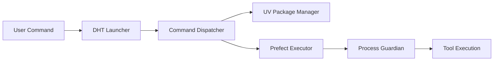

<div align="center">

# DHT - Development Helper Toolkit

[](https://badge.fury.io/py/dht-toolkit)
[](https://pypi.org/project/dht-toolkit/)
[](https://opensource.org/licenses/MIT)
[](https://github.com/yourusername/dht/actions)
[](https://codecov.io/gh/yourusername/dht)
[](https://dht-toolkit.readthedocs.io/)
[](https://pepy.tech/project/dht-toolkit)
[](https://github.com/astral-sh/ruff)

<p align="center">
  <em>⚡ The Python ecosystem's answer to JavaScript's Bolt - Lightning-fast, reliable project management powered by UV</em>
</p>

<p align="center">
  <a href="#key-features">Key Features</a> •
  <a href="#installation">Installation</a> •
  <a href="#quick-start">Quick Start</a> •
  <a href="#documentation">Documentation</a> •
  <a href="#contributing">Contributing</a>
</p>

</div>

---

## 📖 Table of Contents

- [Overview](#overview)
- [Key Features](#key-features)
- [Installation](#installation)
  - [Prerequisites](#prerequisites)
  - [Install via pip](#install-via-pip)
  - [Install from source](#install-from-source)
- [Quick Start](#quick-start)
- [Command Reference](#command-reference)
- [Configuration](#configuration)
- [CI/CD Integration](#cicd-integration)
- [Architecture](#architecture)
- [Troubleshooting](#troubleshooting)
- [Contributing](#contributing)
- [License](#license)

## Overview

DHT (Development Helper Toolkit) is a universal development automation tool that provides standardized workflows, environment management, and project automation. Designed to be familiar to developers coming from JavaScript tooling while leveraging Python's powerful ecosystem.

### 🎯 Why Choose DHT?

<table>
<tr>
<td>

**🚀 Lightning Fast**
- 10-100x faster than pip
- Powered by UV from Astral
- Smart caching system

</td>
<td>

**🔄 Familiar Interface**
- Bolt/Yarn/npm-like commands
- Zero learning curve
- Intuitive CLI design

</td>
<td>

**🛡️ Rock Solid**
- Deterministic builds
- Automatic rollbacks
- Resource protection

</td>
</tr>
<tr>
<td>

**🌍 Cross-Platform**
- macOS, Linux, Windows
- Platform auto-detection
- Consistent behavior

</td>
<td>

**📦 Workspace Ready**
- First-class monorepo support
- Advanced filtering options
- Parallel execution

</td>
<td>

**🔧 Batteries Included**
- Pre-configured tools
- Security scanning
- CI/CD templates

</td>
</tr>
</table>

## Key Features

- ✅ **Drop-in Replacement**: Works with existing Python projects
- ✅ **UV Integration**: Leverages the fastest Python package manager
- ✅ **Smart Commands**: Auto-detects project type and configures itself
- ✅ **Memory Safe**: Built-in guards against runaway processes
- ✅ **Reproducible**: Lock files ensure identical environments everywhere
- ✅ **Developer Friendly**: Rich CLI output with progress indicators
- ✅ **Git Integration**: Built-in support for commits, tags, and GitHub
- ✅ **Container Ready**: Generate Docker/Podman files automatically

## Installation

### Prerequisites

- Python 3.10 or higher
- Git (for version control features)
- UV (automatically installed if not present)

### 🚀 Install via pip

```bash
pip install dht-toolkit
```

### ⚡ Install via UV (Recommended)

```bash
# Install UV if you haven't already
curl -LsSf https://astral.sh/uv/install.sh | sh

# Install DHT
uv pip install dht-toolkit
```

### 🔧 Install from Source

<details>
<summary>Click to expand installation steps</summary>

1. **Clone the repository**:
```bash
git clone https://github.com/yourusername/dht.git
cd dht
```

2. **Create virtual environment**:
```bash
uv venv
source .venv/bin/activate  # On Windows: .venv\Scripts\activate
```

3. **Install dependencies**:
```bash
uv sync --all-extras --dev
uv pip install -e .
```

4. **Verify installation**:
```bash
dhtl --help    # Shows help screen
dhtl version   # Shows version info
```

5. **Set up development tools** (optional):
```bash
uv run pre-commit install  # Install git hooks
uv run pytest             # Run tests
```

</details>

## Quick Start

### 🎬 Getting Started in 60 Seconds

```bash
# Initialize a new Python project
dhtl init my-project
cd my-project

# Add some dependencies
dhtl add requests click rich

# Add dev dependencies
dhtl add --dev pytest black mypy

# Run your project
dhtl run main

# Run tests
dhtl test

# Format and lint
dhtl fmt
dhtl lint
```

### 📸 Visual Overview

```
$ dhtl init my-awesome-project
✨ Creating new Python project 'my-awesome-project'...
📁 Project structure created
🐍 Python 3.11 virtual environment initialized
📦 Dependencies installed
✅ Project ready! Run 'cd my-awesome-project && dhtl' to start.

$ cd my-awesome-project
$ dhtl add numpy pandas matplotlib
➕ Adding numpy, pandas, matplotlib...
📦 Resolving dependencies...
✅ Successfully added 3 packages in 0.8s

$ dhtl test
🧪 Running tests with pytest...
================== test session starts ==================
collected 5 items

tests/test_core.py .....                          [100%]
================== 5 passed in 0.32s ===================
✅ All tests passed!
```

## Command Reference

<details open>
<summary><b>📦 Package Management</b></summary>

```bash
dhtl                        # Install all dependencies
dhtl install               # Same as above
dhtl add <packages>        # Add dependencies
dhtl add --dev <packages>  # Add dev dependencies
dhtl remove <packages>     # Remove dependencies
dhtl upgrade [packages]    # Upgrade packages (all if none specified)
```

</details>

<details open>
<summary><b>🚀 Development</b></summary>

```bash
dhtl run <script>    # Run script from pyproject.toml
dhtl test           # Run tests with pytest
dhtl build          # Build distribution packages
dhtl lint           # Run linters (ruff, mypy)
dhtl fmt            # Format code (alias: format)
dhtl check          # Type check with mypy
dhtl coverage       # Run tests with coverage
```

</details>

<details open>
<summary><b>🏗️ Workspace Management</b></summary>

```bash
# Run in all workspaces
dhtl ws run <script>              # Run script in all packages
dhtl ws exec -- <command>         # Execute command in all packages

# Run in specific workspace
dhtl w <name> run <script>        # Run in specific package
dhtl project run <script>         # Run in root only

# Filtering options
--only <pattern>      # Include matching packages
--ignore <pattern>    # Exclude matching packages
--only-fs <glob>      # Include if files match
--ignore-fs <glob>    # Exclude if files match
```

</details>

<details>
<summary><b>🔧 More Commands</b> (click to expand)</summary>

**Project Management**
```bash
dhtl init [name]     # Create new project
dhtl setup          # Setup environment
dhtl clean          # Clean artifacts
dhtl sync           # Sync dependencies
```

**Version Control**
```bash
dhtl commit         # Create git commit
dhtl tag <name>     # Create git tag
dhtl bump <type>    # Bump version (patch/minor/major)
dhtl clone <url>    # Clone repository
dhtl fork <url>     # Fork on GitHub
```

**Deployment**
```bash
dhtl publish                           # Publish to PyPI
dhtl deploy_project_in_container      # Deploy in Docker
dhtl workflows                        # Manage CI/CD
dhtl act                             # Run GitHub Actions locally
```

**Utilities**
```bash
dhtl env           # Show environment info
dhtl diagnostics   # Run diagnostics
dhtl restore       # Restore from .dhtconfig
dhtl help          # Show help
dhtl version       # Show version
```

</details>

### Global Options

```bash
--help          # Show command-specific help
--quiet         # Reduce output verbosity
--debug         # Enable debug mode
--no-guardian   # Disable process guardian
```

## Configuration

### 📁 Project Structure

DHT works with any Python project structure:

```
my-project/
├── pyproject.toml      # Project configuration
├── uv.lock            # Locked dependencies
├── .dhtconfig         # DHT configuration (auto-generated)
├── src/
│   └── my_package/
├── tests/
└── docs/
```

### 🔧 Script Configuration

Define custom scripts in `pyproject.toml`:

```toml
[project.scripts]
dev = "python -m myapp --debug"
test = "pytest -v"
lint = "ruff check ."
format = "ruff format ."

[tool.dht.scripts]
deploy = "docker build -t myapp ."
docs = "mkdocs serve"
```

### 🏗️ Workspace Setup

For monorepos, configure workspaces in `pyproject.toml`:

```toml
[tool.uv.workspace]
members = ["packages/*", "apps/*"]
exclude = ["packages/experimental"]
```

## Examples

### 🚀 Real-World Examples

<details>
<summary><b>Web Application</b></summary>

```bash
# Create a Flask web app
dhtl init my-web-app --python 3.11
cd my-web-app

# Add web dependencies
dhtl add flask sqlalchemy redis celery
dhtl add --dev pytest pytest-cov black

# Run development server
dhtl run dev

# Run tests with coverage
dhtl coverage
```

</details>

<details>
<summary><b>Data Science Project</b></summary>

```bash
# Initialize with data science template
dhtl init ml-project --template datascience

# Add ML dependencies
dhtl add numpy pandas scikit-learn matplotlib jupyter
dhtl add torch torchvision --index https://download.pytorch.org/whl

# Start Jupyter
dhtl run notebook
```

</details>

<details>
<summary><b>Monorepo Setup</b></summary>

```bash
# Create workspace structure
dhtl init my-monorepo --workspace
cd my-monorepo

# Create sub-packages
dhtl ws new packages/core --template library
dhtl ws new packages/cli --template application
dhtl ws new packages/api --template fastapi

# Install all dependencies
dhtl ws install

# Run tests across all packages
dhtl ws run test --parallel
```

</details>

## CI/CD Integration

### 🔄 GitHub Actions

DHT provides optimized GitHub Actions workflows:

<details>
<summary>Example workflow</summary>

```yaml
# .github/workflows/ci.yml
name: CI
on: [push, pull_request]

jobs:
  test:
    runs-on: ubuntu-latest
    steps:
      - uses: actions/checkout@v4
      - uses: astral-sh/setup-uv@v5
        with:
          enable-cache: true

      - name: Set up Python
        run: uv python install 3.11

      - name: Install and test
        run: |
          uv sync --locked
          uv run pytest
          uv run mypy src/
```

</details>

### 🔒 Pre-commit Hooks

DHT automatically configures pre-commit with:
- UV dependency checks
- Code formatting (Ruff, Black)
- Type checking (MyPy)
- Security scanning (Gitleaks)
- YAML/JSON validation

```bash
# Install pre-commit hooks
uv run pre-commit install

# Run manually
uv run pre-commit run --all-files
```

## Advanced Features

### 🐳 Container Support

```bash
# Generate optimized Dockerfile
dhtl dockerize

# Deploy with port mapping
dhtl deploy --port 8000:8000

# Use Podman instead
dhtl deploy --podman
```

### 🔄 Environment Reproduction

DHT captures your exact environment:

```bash
# Save environment snapshot
dhtl snapshot

# Recreate on another machine
dhtl restore

# Share via .dhtconfig
git add .dhtconfig
git commit -m "Add environment config"
```

### 🚀 Performance Features

- **Parallel Execution**: Run commands across workspaces in parallel
- **Smart Caching**: Reuse builds and test results
- **Incremental Builds**: Only rebuild what changed
- **Resource Limits**: Prevent runaway processes

## Architecture

<details>
<summary><b>🏗️ How DHT Works</b></summary>

### Core Design



### Key Components

- **🚀 UV Integration**: 10-100x faster than pip
- **🛡️ Process Guardian**: Memory and timeout protection
- **🔄 Prefect Workflows**: Reliable task execution
- **🌍 Platform Adapters**: Cross-platform compatibility
- **📦 Smart Caching**: Intelligent dependency resolution

### Project Structure

```
src/DHT/
├── modules/         # Core functionality
├── commands/        # CLI commands
├── parsers/         # File analyzers
└── flows/          # Workflow definitions
```

</details>

## Troubleshooting

<details>
<summary><b>❓ Common Issues</b></summary>

### Command not found
```bash
# Verify installation
pip show dht-toolkit
which dhtl

# Add to PATH if needed
export PATH="$HOME/.local/bin:$PATH"
```

### Permission errors
```bash
# Install for current user
pip install --user dht-toolkit

# Or use pipx
pipx install dht-toolkit
```

### UV issues
```bash
# Reinstall UV
curl -LsSf https://astral.sh/uv/install.sh | sh

# Or via pip
pip install --upgrade uv
```

### Debug mode
```bash
# Enable verbose logging
dhtl --debug <command>

# Check environment
dhtl env
dhtl diagnostics
```

</details>

## Security

- 🔒 **Secret Detection**: Gitleaks integration prevents credential leaks
- 📦 **Dependency Audit**: Automatic scanning for vulnerabilities
- 🛡️ **Sandboxed Execution**: Isolated command environments
- 🚦 **Resource Limits**: Protection against runaway processes

## Contributing

We welcome contributions! Check out our [Contributing Guide](CONTRIBUTING.md) to get started.

<details>
<summary><b>🔧 Development Setup</b></summary>

```bash
# Clone and setup
git clone https://github.com/yourusername/dht.git
cd dht
uv venv && source .venv/bin/activate

# Install dev dependencies
uv sync --all-extras --dev
uv pip install -e .

# Setup tools
uv run pre-commit install

# Run tests
uv run pytest -v
uv run mypy src/
```

</details>

## Support

- 📖 [Documentation](https://dht-toolkit.readthedocs.io/)
- 💬 [Discussions](https://github.com/yourusername/dht/discussions)
- 🐛 [Issue Tracker](https://github.com/yourusername/dht/issues)
- 📧 [Email Support](mailto:support@dht-toolkit.org)

## License

MIT License - see [LICENSE](LICENSE) for details.

## Acknowledgments

DHT stands on the shoulders of giants:

- [UV](https://github.com/astral-sh/uv) - Lightning-fast Python package management
- [Ruff](https://github.com/astral-sh/ruff) - Lightning-fast Python linting
- [Prefect](https://www.prefect.io/) - Modern workflow orchestration
- [Bolt](https://github.com/boltpkg/bolt) - Inspiration from the JavaScript ecosystem

---

<div align="center">

**[⬆ back to top](#dht---development-helper-toolkit)**

<p>
  <sub>Built with ❤️ by the Python community</sub><br>
  <sub>Star ⭐ this repo if you find it useful!</sub>
</p>

[](https://github.com/yourusername/dht/stargazers)
[](https://twitter.com/dht_toolkit)

</div>
